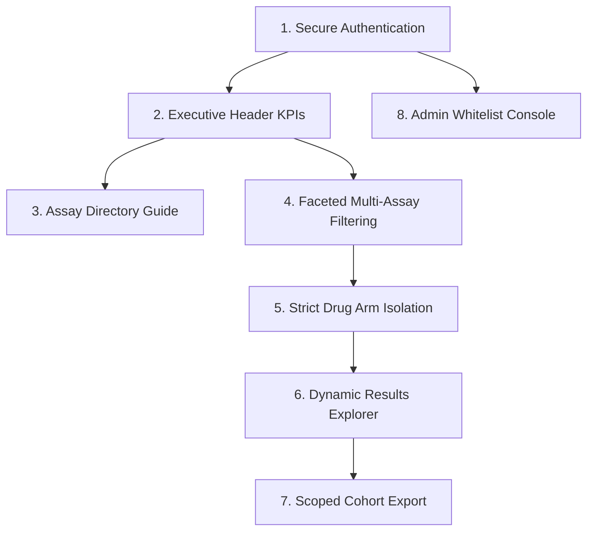

# 🔬 Farcast TruTumor™ Multimodal Database Portal
## Executive Project Demonstration & Walkthrough Guide

---

## 📌 1. Project Overview & Value Proposition

The **Farcast TruTumor™ Multimodal Database Portal** is a secure, high-performance, enterprise platform designed for immuno-oncology researchers, data scientists, and biopharma partners to search, filter, analyze, and export multi-omics tumor explant datasets.

### Key Highlights:
* **Centralized Multi-Assay Repository**: Unifies Histopathology (H&E / IHC), Cytokine Release Assays (Multiplex Luminex/MSD), NanoString (IO360 mRNA & GES Signatures), and Spatial Imaging (mIHC).
* **Strict Cloud Architecture**: Integrated directly with **Supabase Cloud PostgreSQL** with isolated data I/O and zero stale local dependencies.
* **Role-Based Access Control (RBAC)**: Fine-grained user whitelisting, study-scoping permissions, and JWT token authentication.
* **Precision Filtering**: Advanced multi-parameter faceted filtering, clinical sample qualification toggles, and strict treatment arm isolation.

---

## 📊 2. Live Database Assets & Statistics

| Data Dimension | Live Count | Description |
| :--- | :---: | :--- |
| **Total Clinical Samples** | **2,148** | Patient explant cases across multiple tumor indications |
| **Qualified Samples** | **1,592** | Quality-controlled samples meeting stringent pathology & viability standards |
| **Unique Drug / Regimens** | **58** | Curated single-agent and combination therapy regimens |
| **Histopathology Readouts** | **21,271 rows** | Baseline (TBL) and 72h (T72) explant morphological & apoptosis scores |
| **Cytokine Secretion Profiles** | **2,665 rows** | Multiplexed immune cytokines across **Runs 40 to 173** (246 unique samples) |
| **NanoString Digital Profiles** | **512 rows** | IO360 panel mRNA expression and Gene Expression Signatures (135 samples) |
| **Multiplex IHC (mIHC)** | **77 rows** | High-plex spatial biomarker imaging datasets (74 samples) |

---

## 🗺️ 3. End-to-End Portal Navigation & Presentation Flow



---

### Step 1: Secure Authentication & Whitelisting
* **Login & Registration**:
  * Users register with their organizational work email.
  * **Whitelist Security Engine**: Newly registered users cannot access data until an administrator whitelists their account.
  * Session persistence backed by cryptographically signed JWT tokens.

---

### Step 2: Executive Header & Interactive KPI Badges
At the top of the portal, five dynamic KPI stat badges display live database health:

1. **`2148 Samples`**: Click to open instant dropdown breakdown by cancer type (*Head & Neck, Breast, CRC, Lung, etc.*).
2. **`1592 Qualified`**: Click to view the R&D vs. BioPharma qualification breakdown.
3. **`58 Drugs`**: Click to view the most frequent therapeutic agents (*Nivolumab, Cisplatin, Paclitaxel, Carboplatin, etc.*).
4. **`4 Assay Types`**: Shows sample distribution across multi-omics assay types.
5. **`2 Study Types`**: Scoped views for Internal R&D and BioPharma partner studies.

> **Presentation Tip**: Click any row in a header stat dropdown to instantly apply that filter to the entire portal!

---

### Step 3: 🔬 Assay Directory & Parameter Guide
Click the **`🔬 Assay Details`** button in the header to open the interactive multi-omics dictionary:

* **Histopathology**:
  * *Parameters*: `Tumor_%`, `Necrosis` (Scale 1–5), `Discohesion` (Scale 1–5), `Pyknosis` (Scale 1–5), `Immune_component_%`, `Tumor_infiltrated_immune (%)`, `Cas-3` apoptosis %.
* **Cytokine Release Assay**:
  * *Parameters*: `IFN-γ`, `Perforin`, `Granzyme B`, `IL-10`, `TNF-α`, `IL-1β`, `IL-2`, `MMP-9`, `IP-10 (CXCL10)`, `IL-6`, `IL-8 (CXCL8)`, `Fractalkine`, `G-CSF`, `GM-CSF`, `I-TAC`, `MCP-1`, `MIG`, `M-CSF`.
* **NanoString**:
  * *Panels*: IO360 770-gene mRNA expression, Gene Expression Signatures (GES), and Baseline Tissue (TBL) profiles.
* **Flow Cytometry**:
  * *Subsets*: `CD45+`, `Macrophage`, `M2`, `T cell`, `CD4+`, `Treg`, `CTL`, `CD8+Ki67+`, `CD8+GranzymeB+`, `CD4+FoxP3+CTLA4+`, etc.
* **mIHC & Metadata**:
  * Spatial fluorescent imaging biomarkers, clinical tumor staging, pathology grades, and protocol metadata.
* **Features**: Live search bar with instant biomarker highlighting and category quick-tabs.

---

### Step 4: Left-Hand Multi-Dimensional Filter Engine

1. **Qualification Status Toggle (Default: ON)**:
   * **Active**: Limits all queries and dropdown counts strictly to **Qualified Samples** (1,592 samples).
   * **Inactive**: Expands view to include all historical and exploratory samples (2,148 samples).
2. **Cancer Indication Filter**: Multi-select pills with live sample counter badges.
3. **Drug & Treatment Filter**:
   * Multi-select across single agents and combination therapies.
4. **Secondary Strict Drug Filter**:
   * *Example*: Selecting `Nivolumab_Cmax + Sunitinib` with Strict Mode enabled returns **only the control arm (`RXA`) and that exact treatment arm**, stripping out unrelated combinations for pure pharmacodynamic comparisons.
5. **Assay Presence Multi-Select**: Filter samples having specific assay readouts (*e.g., Samples with both Histopathology AND Cytokine data*).
6. **Study / Register Type Scoping**: Filter between Internal R&D and BioPharma projects.

---

### Step 5: Interactive Results Explorer Table
* **Master Sample View**: Displays Patient ID, Cancer Type, Tumor Site, Stage/Grade, Study Code, Qualification status, and available assay badges.
* **Expandable Row Drawer**: Click any sample to inspect its explant-level treatment arm positions (`A`, `B`, `C`, `D`...) and assigned drug details.
* **Multi-Column Sorting & Pagination**: Fast sort on any clinical or assay parameter.

---

### Step 6: Cohort Export & Analytics Download
* **One-Click Export**: Export filtered cohorts directly into clean Excel/CSV formats.
* **Strict Filter Integrity**: Downloaded assay datasets respect strict drug filtering, guaranteeing downstream analytical integrity.

---

### Step 7: Admin Security & Access Control Console
*(Accessible only to users with the `admin` role)*
* **User Management Table**: View all registered users, roles, and registration timestamps.
* **One-Click Whitelisting**: Instantly approve pending researcher accounts.
* **Study Scoping**: Assign restricted study access (*e.g., restrict a partner to BioPharma studies only*).
* **Role Promotion / Revocation**: Seamlessly promote users to administrators or deactivate accounts.

---

## 🛠️ 4. Technical Architecture

```
┌────────────────────────────────────────────────────────┐
│               Frontend: React 18 + Vite                │
│    Glassmorphism UI • State Store • Responsive Views   │
└──────────────────────────┬─────────────────────────────┘
                           │ HTTP / REST API (JWT Bearer)
┌──────────────────────────▼─────────────────────────────┐
│                 Backend: FastAPI (Python)              │
│    Authentication • RBAC Engine • Multi-Omics Search   │
└──────────────────────────┬─────────────────────────────┘
                           │ Connection Pool (SQLAlchemy)
┌──────────────────────────▼─────────────────────────────┐
│          Cloud Database: Supabase PostgreSQL           │
│  metadata • overlay • assay_histopathology •           │
│  assay_cytokine • assay_nanostring • assay_mihc        │
└────────────────────────────────────────────────────────┘
```

---

## 💡 5. Anticipated Questions & Presentation Talking Points

### Q1: Why did the Drug list count change to 58?
> *"The raw dataset previously contained unmapped arm codes (such as `RXA`, `RXB`, `ARM1`) and SDF notes in the drug column. We implemented a curation pipeline that filtered out arm codes and text remarks into their proper columns, leaving **58 clean, verified therapeutic agents and controls** in the Drug dictionary."*

### Q2: How is data security and clinical sample privacy enforced?
> *"The platform enforces a zero-trust model: self-registration is allowed, but database queries require an active JWT session and an administrator-whitelisted email. Furthermore, study-scoping rules dynamically restrict biopharma partners to their authorized projects."*

### Q3: How does the qualification toggle work?
> *"The toggle defaults to `ON` to ensure clinical decision-making relies exclusively on samples that passed all quality criteria (`Final Qualification`). Researchers can toggle it `OFF` when doing exploratory or QC troubleshooting across all 2,148 samples."*

---

## 🚀 6. Demo Script Summary (2-Minute Pitch)

1. **0:00 - 0:30**: Sign In & show executive header stats (**2,148 samples**, **1,592 qualified**, **58 drugs**).
2. **0:30 - 0:50**: Open the **`🔬 Assay Details`** modal to show the multi-omics parameter dictionary and search `IFN-γ`.
3. **0:50 - 1:20**: Select a Cancer Type (*e.g. Head & Neck*), turn on a Drug (*e.g. Nivolumab_Cmax*), and demonstrate the **Secondary Strict Drug Filter** isolating the control and treatment arms.
4. **1:20 - 1:40**: Expand a sample row to reveal explant treatment arm mapping and show assay coverage badges.
5. **1:40 - 2:00**: Switch to the **🛡️ Admin Console** to show user whitelisting, study permission scoping, and one-click data export.

---
*Farcast Biosciences Confidential & Proprietary — TruTumor™ Multimodal Platform*
